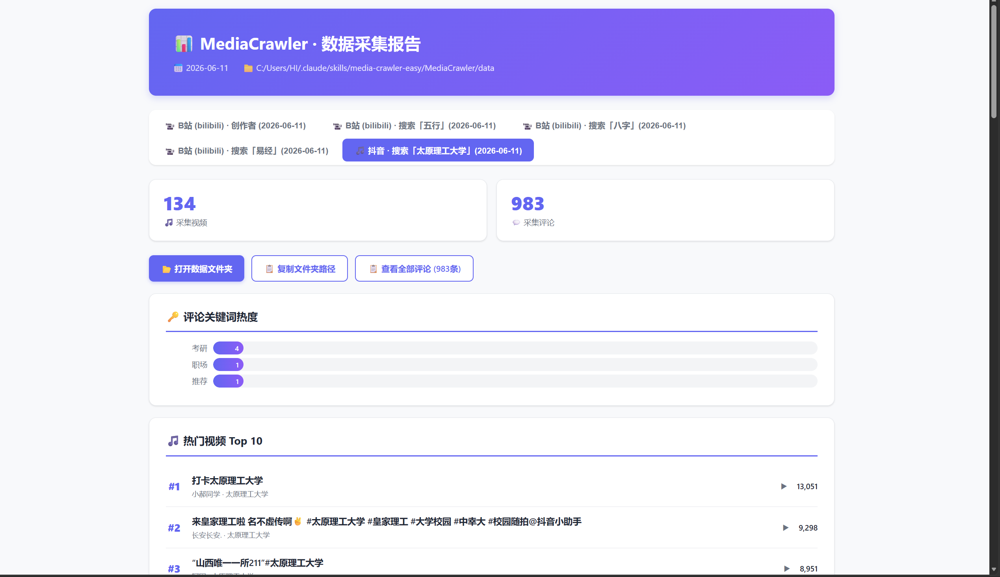
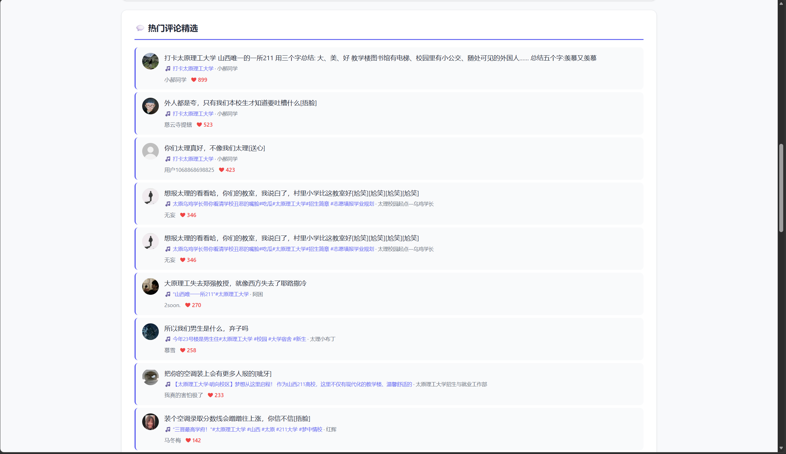
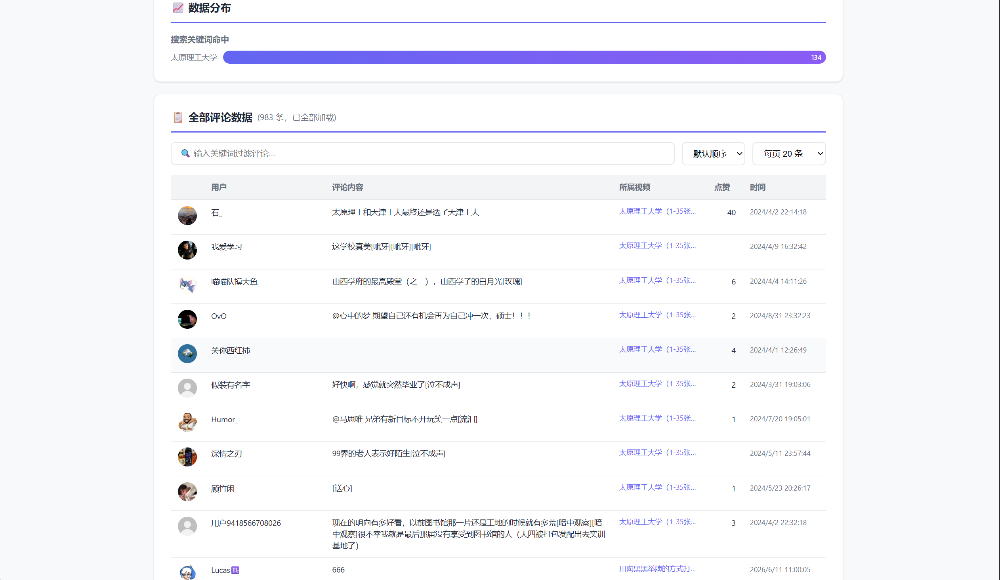

# media-crawler-easy

> 在对话里说一句「帮我爬小红书上关于 XX 的笔记评论」，剩下的交给它 —— 环境自检、扫码登录、采集、生成交互式 HTML 报告，全程不用写代码，也不用改配置文件。

> Collect comments from seven Chinese social platforms (Bilibili / Xiaohongshu / Douyin / Kuaishou / Weibo / Tieba / Zhihu) inside your coding agent, without writing code.

[](LICENSE)
[](https://github.com/isheng-eqi/media-crawler-easy/stargazers)
[](https://www.python.org/)

## 为什么存在

社媒评论采集的技术难点早就被解决了，真正耗时间的是它周围的一圈杂事：装环境、改配置、判断二维码有没有弹出来、跑完之后还得自己确认拿到的是数据还是空文件。

上游 MediaCrawler 给的是完整的控制权，代价是每一步都要自己盯着。本项目把其中最高频的一条路径收窄成了对话：

|  | 直接使用上游 MediaCrawler | 本项目 |
| --- | --- | --- |
| 上手 | 配置 Python 环境、clone、读文档、手改 `base_config.py` | clone 进 skills 目录，然后在对话里说一句话 |
| 配置 | 手改配置文件，多个参数要改对 | Agent 用 3 轮问答问清楚，自己写进配置 |
| 卡住时 | 自己读日志判断卡在哪一步 | 按日志信号判断：二维码是否弹出、是否登录成功、60 秒无进展即提示检查滑块 |
| 产物 | CSV，报告要自己接 | 交互式 HTML 报告 + CSV，开箱即用 |
| 确认真的拿到数据 | 靠人眼核对，空 CSV 常常事后才发现 | 空 CSV 自动从 JSONL 重建；报告生成后先过 JS 校验，通过才打开 |

这不是上游的替代品。需要自定义采集流程、代理池、写数据库的场合，用上游；只是想把某个平台的评论拿下来看看的场合，用这个。

## 快速开始

两步。

第一步，安装。两种方式二选一。

方式 A 作为插件安装（推荐，之后能跟随仓库更新）。在 Claude Code 里执行两条命令：

```
/plugin marketplace add isheng-eqi/media-crawler-easy
/plugin install media-crawler-easy@media-crawler-easy
```

方式 B 直接 clone 到 skills 目录（适合手动管理，或其他遵循 Agent Skills 约定的助手）：

```bash
# macOS / Linux
git clone https://github.com/isheng-eqi/media-crawler-easy ~/.claude/skills/media-crawler-easy
```

```powershell
# Windows PowerShell
git clone https://github.com/isheng-eqi/media-crawler-easy $env:USERPROFILE\.claude\skills\media-crawler-easy
```

第二部分，打开 Claude Code，直接说：

```
帮我爬小红书「考研二战」的笔记评论
```

Skill 会按描述自动加载，然后是一段这样的对话（示例，实际条数取决于你的回答）：

```
要爬哪个平台？
A. B站   B. 小红书   C. 抖音   D. 快手

> B

用什么方式爬？
A. 关键词搜索   B. 指定链接   C. 创作者主页

> A

关键词是什么？每个关键词爬多少条？（默认 20）

> 考研二战，20

每条内容爬多少评论？（默认 30）要楼中楼吗？要词云图吗？爬取间隔几秒？

> 默认

[环境检测] 12 项通过，0 项修复，可以继续
[登录] 请用手机 App 扫码（30 秒内完成）
[采集] 笔记 20 条，评论 600 条
[报告] JS 语法校验通过 —— 已在浏览器打开 小红书_评论报告.html
```

采集过程中会弹出一个 Chrome 窗口，扫码之后不用管它。

## 支持的平台与模式

| 平台 | 代码 | 关键词搜索 | 指定链接 | 创作者主页 |
| --- | --- | --- | --- | --- |
| B站 | `bili` | 是 | 指定视频 | UP 主主页 |
| 小红书 | `xhs` | 是 | 指定笔记 | 博主主页 |
| 抖音 | `dy` | 是 | 指定视频 / 图文 | 创作者主页 |
| 快手 | `ks` | 是 | 指定视频 | 创作者主页 |
| 微博 | `wb` | 是 | 指定帖子 | — |
| 贴吧 | `tieba` | 是 | 指定贴子 | — |
| 知乎 | `zhihu` | 是 | 指定问答 | — |

## 你会拿到什么

**CSV 数据**，在 `MediaCrawler/data/<平台>/csv/` 下，分内容表与评论表。字段包括标题、链接、播放量、点赞数、作者信息、评论内容、评论点赞数、发布时间、用户昵称、IP 属地等，可直接用 Excel / WPS 打开，也可以丢进 Python 或 R 继续分析。同一份数据另有 JSONL 格式备份。

**交互式 HTML 报告**，同时放在桌面和项目内。报告扫描 `data/` 下所有平台、所有采集类型、所有日期的数据，按「平台 / 类型 / 日期」分 Tab 持续累积，包含：

- 内容封面、多维统计栏、创作者档案卡片
- 评论图片直显，点击放大
- 全部评论表格，支持搜索、排序、分页（每页 20 / 50 / 100 条）
- 评论关键词热度柱状图与数据分布

报告长这样：







## 它是怎么做的

```
你的一句话
    │
    ▼
① 3 轮问答 ── 平台 → 模式与参数 → 评论设置
    │
    ▼
② 环境自检 ── 缺什么装什么，pip 超时自动切国内镜像
    │
    ▼
③ 写入配置 ── base_config.py（Agent 改，不用你改）
    │
    ▼
④ 启动采集 ── 扫码登录 → 日志监控 → 写入 CSV / JSONL
    │
    ▼
⑤ 生成报告 ── 先 --no-open 生成 → node --check 校验 → 通过才打开
    │
    ▼
交互式 HTML 报告 + CSV 数据
```

几个值得单独说的机制：

**登录是爬虫最容易卡住的地方，所以它被当成状态机处理。** 每轮检查日志时按信号判断当前处于哪一步：二维码弹出、登录成功、还是进入登录流程但迟迟没有后续。启动 60 秒后没有新日志，说明大概率撞上了滑块或页面结构变化，会提示你去 Chrome 窗口手动点一下登录按钮。

**报告先校验，再打开。** 报告页面的交互靠内嵌 JavaScript，脚本一旦有语法错误，你看到的是一片空白。所以生成分两步：先 `--no-open` 生成，用 `node --check` 校验脚本，通过之后才重新生成并自动打开浏览器。

**空数据有回退路径。** 采集偶尔会出现 CSV 为空而 JSONL 有数据的情况，报告生成器会自动从 JSONL 重建，避免「跑完了、看起来成功了、其实什么都没拿到」。

**采集完可以一键清理。** 浏览器缓存和 Python 字节码目录加起来几百 MB，清理脚本只删这些，CSV 和 HTML 报告不动。

**配置问答不允许合并。** 平台、模式、参数、评论设置分三轮问，每轮一个问题、选项不超过四个 —— 一次性抛出十几个待填项是让人放弃的第一步。

> 爬虫真正的难点不是「能不能爬到」，而是「怎么知道到底爬到了没有」。
> 所以这个项目的每一步都尽量做成可验证的：环境可检测、登录有信号、空数据有回退、报告先校验再打开。

## 前置条件

| 项目 | 要求 |
| --- | --- |
| 操作系统 | Windows 10+ / macOS 11+ / Ubuntu 20.04+ |
| Python | ≥ 3.10，安装时勾选 Add to PATH |
| Node.js | ≥ 16，仅用于报告脚本校验，缺失不影响采集 |
| 浏览器 | Chrome 或 Edge 最新稳定版 |
| 磁盘 | ≥ 2GB 可用 |
| 内存 | ≥ 4GB，推荐 8GB |
| 账号 | 首次采集需用手机 App 扫码一次，之后复用登录态；贴吧、知乎通常不需要登录 |
| 网络 | 需要能访问 PyPI，pip 超时会自动切换清华 / 阿里镜像 |

Windows 上如果安装 `opencv-python` 报 `Microsoft Visual C++ 14.0 is required`，装一个 Visual C++ Build Tools 即可。

## 合规与许可

本项目仅用于学习研究。采集对象是平台公开信息，请勿用于商业用途或大规模抓取；默认采集间隔 2 秒，调快会触发平台风控，风险由使用者承担。

许可分两部分：

- 本仓库自有代码（`SKILL.md`、`README.md`、`scripts/`、`references/`）为 MIT，见 [LICENSE](LICENSE)
- `MediaCrawler/` 目录是上游仓库的完整副本，沿用其 NON-COMMERCIAL LEARNING LICENSE 1.1（非商用学习），原协议文件保留在 `MediaCrawler/LICENSE`

完整说明与使用边界见 [NOTICE.md](NOTICE.md)。使用者需自行遵守目标平台的服务条款与所在地法律。

## 来源

本项目构建在 [NanmiCoder/MediaCrawler](https://github.com/NanmiCoder/MediaCrawler) 之上。`MediaCrawler/` 目录保留了上游的完整代码与协议，这样使用者不需要自己处理环境配置。上游解决的问题是这个项目存在的前提，本项目只重做了它外面那一圈交互。

`SKILL.md` 采用通用的 Agent Skills 形态（说明文件 + 参考文件 + 脚本），目前只在 Claude Code 上验证过；其他遵循同一约定的编程助手理论上可以复用同一份文件，但安装路径与触发机制各不相同。技能内部不写死安装路径：脚本按自身位置解析数据目录，`SKILL.md` 里的目录以「本文件所在目录」表述，因此插件安装和 clone 安装都能正常工作。

仓库同时是一个 Claude Code 插件市场（`.claude-plugin/marketplace.json`），因此可用 `/plugin marketplace add isheng-eqi/media-crawler-easy` 直接安装；插件的清单文件是 `.claude-plugin/plugin.json`。

相关文件：

- `SKILL.md` —— Skill 主文件，Agent 的执行流程
- `.claude-plugin/` —— 插件清单与插件市场目录，供 `/plugin marketplace add` 使用
- `references/` —— 环境排错、已知问题、报告模板改法、配置项说明
- `scripts/env_setup.py` —— 环境检测与修复
- `scripts/generate_report.py` —— 报告生成器
- `scripts/cleanup.py` —— 临时文件清理
